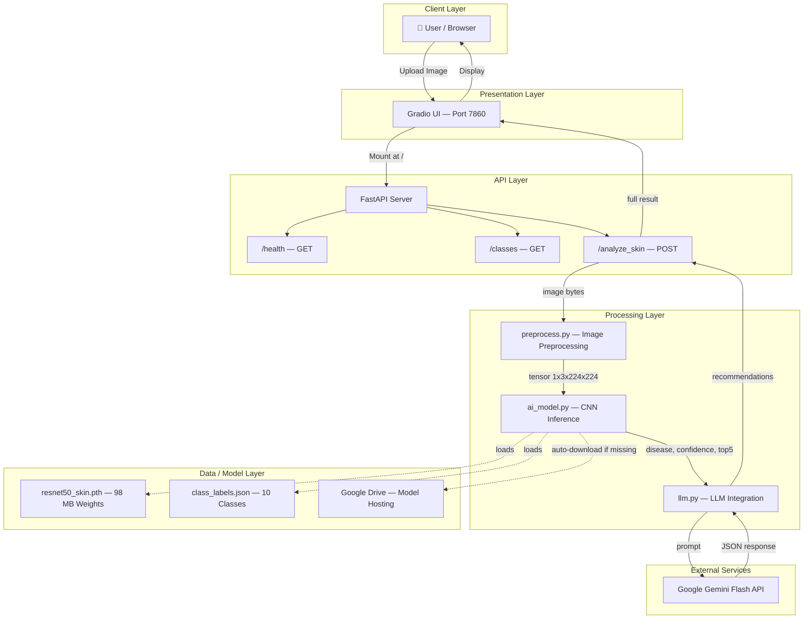
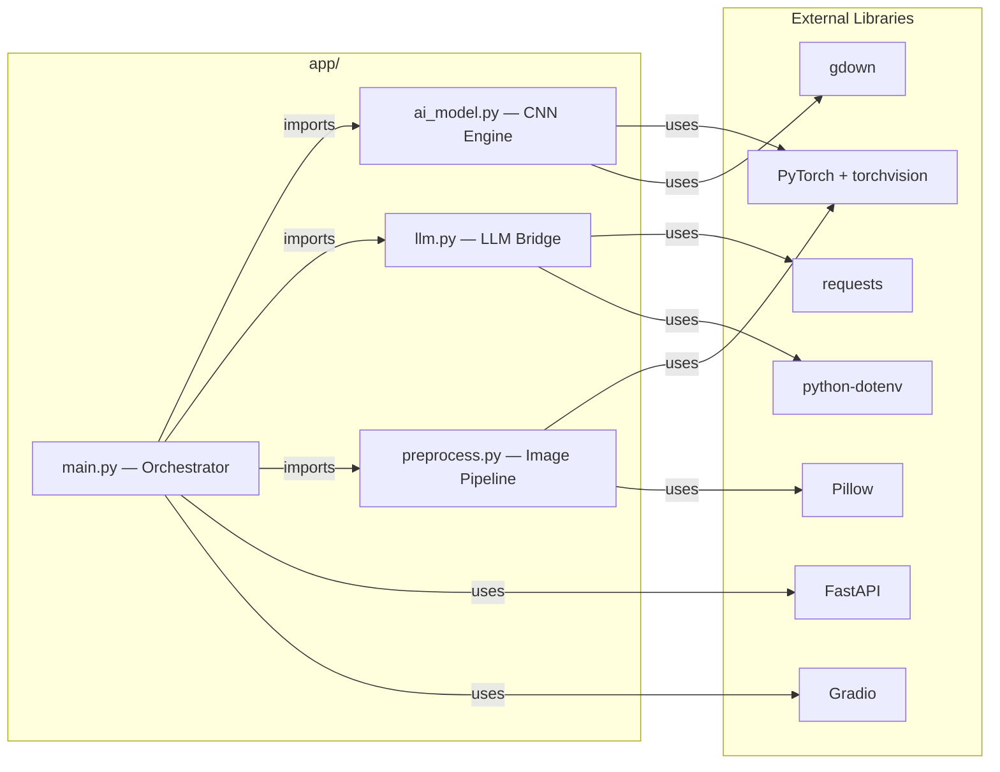
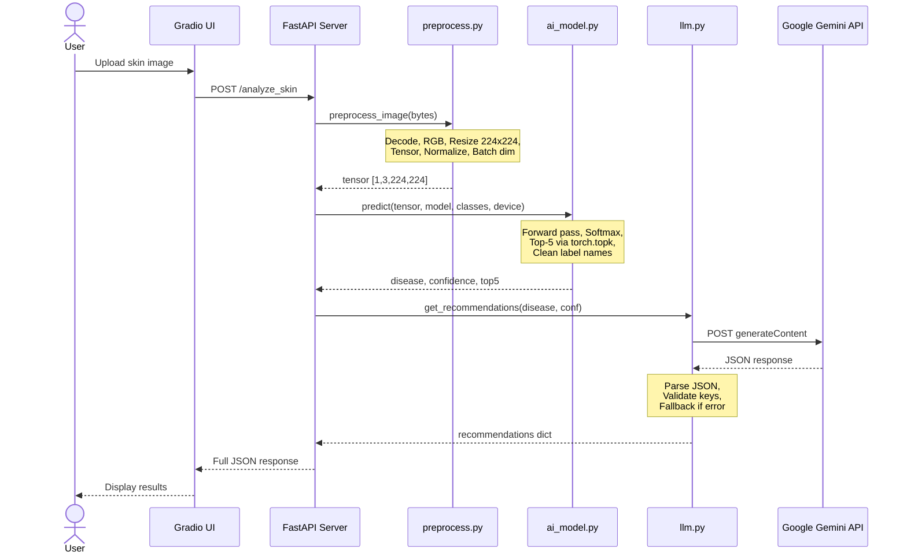
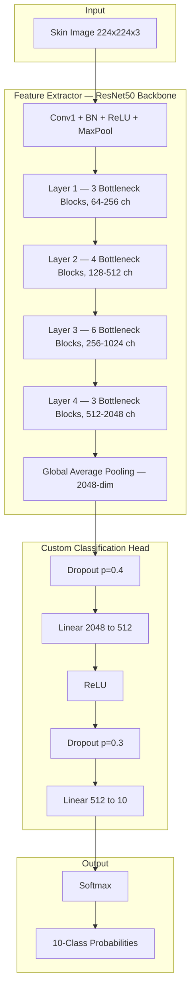
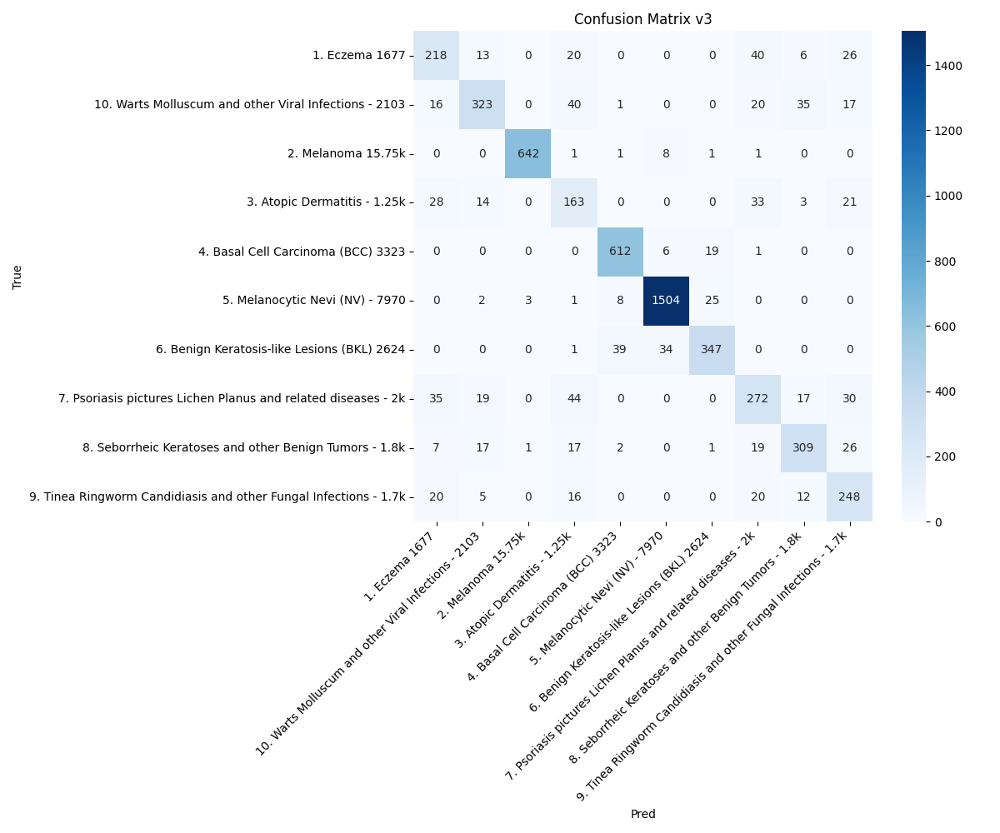
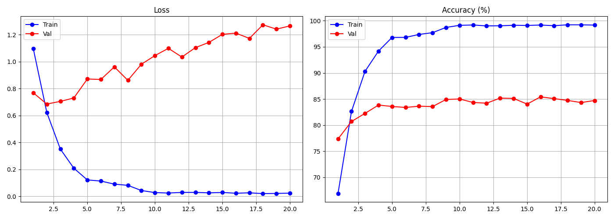
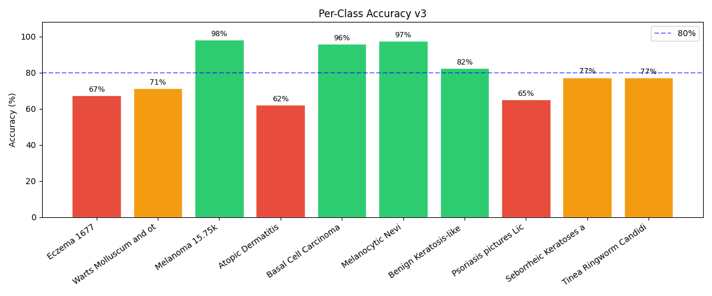
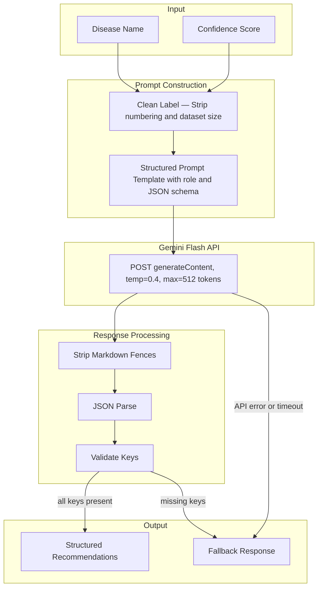
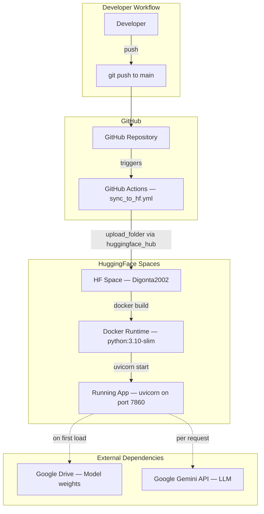
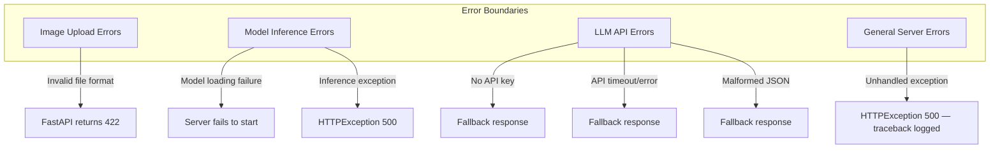

# 🩺 Skin Disease Detection & LLM Advisor System

> **Version:** 1.0.0 · **Last Updated:** 2026-05-03

**Objective:** A real-time AI-powered system that analyzes skin images, detects diseases accurately using a pre-trained CNN, and provides meaningful recommendations using an LLM.

**Problem Statement:** Users can upload skin images. The system classifies diseases, generates explanations using an LLM (Gemini Flash), and provides real-time API responses.

---

## Table of Contents

- [System Architecture](#system-architecture)
- [Project Structure](#project-structure)
- [Component Deep Dive](#component-deep-dive)
- [Data Flow — Request Lifecycle](#data-flow--request-lifecycle)
- [ML Model Architecture](#ml-model-architecture)
- [LLM Integration Architecture](#llm-integration-architecture)
- [API Contract](#api-contract)
- [Deployment Architecture](#deployment-architecture)
- [Error Handling Architecture](#error-handling-architecture)
- [Technology Stack](#technology-stack)
- [Setup & Installation](#setup--installation)
- [Docker Deployment](#docker-deployment)
- [Security Considerations](#security-considerations)
- [Future Improvements](#future-improvements)

---

## System Architecture



---

## Project Structure

```
skin-disease-ai/
├── .github/
│   └── workflows/
│       └── sync_to_hf.yml        # CI/CD: auto-deploy to HuggingFace Spaces
├── app/
│   ├── main.py                    # FastAPI app + Gradio mount + endpoints
│   ├── ai_model.py                # ResNet50 model build, load, predict
│   ├── llm.py                     # Gemini Flash prompt engineering + API call
│   └── preprocess.py              # Image resize, tensor conversion, normalization
├── model/
│   ├── resnet50_skin.pth          # Trained model checkpoint (~98 MB)
│   ├── class_labels.json          # 10-class label mapping
│   ├── cm_v3.png                  # Confusion matrix visualization
│   ├── curves_v3.png              # Training/validation curves
│   └── pca_v3.png                 # PCA feature space visualization
├── ui/
│   └── app.py                     # Standalone Gradio client (HTTP mode)
├── train_model_v3.ipynb           # Jupyter notebook for model training
├── requirements.txt               # Python dependencies
├── Dockerfile                     # Docker containerization
├── .gitignore                     # Git ignore rules
└── README.md                      # This file
```

---

## Component Deep Dive

### Module Dependency Graph



### Module Descriptions

| Module | File | Responsibility |
|--------|------|---------------|
| **Orchestrator** | `app/main.py` | FastAPI app initialization, endpoint routing, Gradio UI mounting, request coordination |
| **CNN Engine** | `app/ai_model.py` | Model architecture definition (ResNet50 + custom FC head), weight loading, auto-download from Google Drive, inference with Top-5 predictions |
| **LLM Bridge** | `app/llm.py` | Prompt engineering for dermatology context, Gemini Flash API integration, response parsing, fallback handling |
| **Image Pipeline** | `app/preprocess.py` | Image decoding, resizing to 224×224, tensor conversion, ImageNet normalization |
| **Gradio Client** | `ui/app.py` | Standalone Gradio frontend (HTTP client mode) for external API consumption |

---

## Data Flow — Request Lifecycle



---

## ML Model Architecture

### ResNet50 with Custom Classification Head



### Classification Classes

| # | Disease Class | Description |
|---|--------------|-------------|
| 1 | **Eczema** | Chronic inflammatory skin condition |
| 2 | **Melanoma** | Most dangerous type of skin cancer |
| 3 | **Atopic Dermatitis** | Genetic form of eczema |
| 4 | **Basal Cell Carcinoma (BCC)** | Most common skin cancer |
| 5 | **Melanocytic Nevi (NV)** | Common moles |
| 6 | **Benign Keratosis-like Lesions (BKL)** | Non-cancerous skin growths |
| 7 | **Psoriasis / Lichen Planus** | Autoimmune skin disorders |
| 8 | **Seborrheic Keratoses** | Benign skin tumors |
| 9 | **Tinea / Ringworm / Candidiasis** | Fungal skin infections |
| 10 | **Warts / Molluscum / Viral Infections** | Viral skin conditions |

### Model Performance

> **Validation Accuracy: 80.64%**

| Visualization | Description |
|--------------|-------------|
|  | 10-class classification performance |
|  | Loss and accuracy convergence |
|  | 2D feature space projection |

### Image Preprocessing Pipeline

| Step | Operation | Detail |
|------|-----------|--------|
| 1 | Decode | `PIL.Image.open()` from raw bytes |
| 2 | Color convert | `.convert("RGB")` — ensure 3 channels |
| 3 | Resize | `transforms.Resize((224, 224))` — bilinear interpolation |
| 4 | To Tensor | `transforms.ToTensor()` — HWC uint8 → CHW float32 |
| 5 | Normalize | Mean `[0.485, 0.456, 0.406]`, Std `[0.229, 0.224, 0.225]` |
| 6 | Batch dim | `.unsqueeze(0)` — shape becomes `[1, 3, 224, 224]` |

---

## LLM Integration Architecture

### Prompt Engineering Flow



### LLM Response Schema

```json
{
  "recommendations": "2-3 sentences about the condition and general advice",
  "next_steps": "2-3 concrete next steps the patient should take",
  "tips": "2-3 practical daily care tips for managing this condition"
}
```

### Fallback Strategy

The system implements a **graceful degradation** pattern:

| Scenario | Behavior |
|----------|----------|
| API key not set / placeholder | Return generic safe advice immediately |
| API call fails (network error) | Catch exception, log, return fallback |
| API timeout (>15s) | `requests.post` timeout triggers fallback |
| Malformed JSON response | `json.loads` fails → fallback |
| Missing keys in response | Fill missing keys from fallback dict |

---

## API Contract

### Endpoints

| Method | Endpoint | Description | Response |
|--------|----------|-------------|----------|
| `GET` | `/health` | Health check | `{ "message": "API is running ✅" }` |
| `GET` | `/classes` | List all 10 disease classes | `{ "classes": [...], "total": 10 }` |
| `POST` | `/analyze_skin` | Upload image → analysis | Full prediction + LLM advice |

### POST /analyze_skin — Full Contract

**Request:**
```
POST /analyze_skin
Content-Type: multipart/form-data

file: <image.jpg | image.png>
```

**Response (200 OK):**
```json
{
  "disease": "Melanoma",
  "confidence": 0.9991,
  "confidence_pct": "99.91%",
  "top5_predictions": [
    { "disease": "Melanoma", "confidence": 0.9991 },
    { "disease": "Basal Cell Carcinoma (BCC)", "confidence": 0.0005 },
    { "disease": "Melanocytic Nevi (NV)", "confidence": 0.0002 },
    { "disease": "Benign Keratosis-like Lesions (BKL)", "confidence": 0.0001 },
    { "disease": "Eczema", "confidence": 0.0001 }
  ],
  "recommendations": "Melanoma is a serious form of skin cancer...",
  "next_steps": "1. Consult a dermatologist immediately...",
  "tips": "Protect the area from sun exposure..."
}
```

**Response (500 Internal Server Error):**
```json
{
  "detail": "Error description"
}
```

---

## Deployment Architecture

### Container & CI/CD Pipeline



### Docker Configuration

| Aspect | Detail |
|--------|--------|
| **Base Image** | `python:3.10-slim` (minimal Debian) |
| **Port** | 7860 (HuggingFace Spaces convention) |
| **Entrypoint** | `uvicorn app.main:app --host 0.0.0.0 --port 7860` |
| **Model Weights** | Auto-downloaded from Google Drive on first startup |
| **Environment Variables** | `GEMINI_API_KEY` (required for LLM features) |

### CI/CD — HuggingFace Sync

The GitHub Actions workflow (`.github/workflows/sync_to_hf.yml`):

1. **Trigger:** Push to `main` branch or manual dispatch
2. **Action:** Uploads the entire repository folder to HuggingFace Spaces
3. **Auth:** Uses `HF_TOKEN` secret stored in GitHub repository settings
4. **Target:** `Digonta2002/skin-disease-detector` Space (Docker SDK)

---

## Error Handling Architecture



> **Key Design Decision:** The LLM module never crashes the application. All Gemini API failures gracefully degrade to a pre-defined fallback response, ensuring the user always receives meaningful output.

---

## Technology Stack

| Layer | Technology | Version | Purpose |
|-------|-----------|---------|---------|
| **Web Framework** | FastAPI | 0.111.0 | REST API with async support |
| **Frontend** | Gradio | 4.36.1 | Interactive ML demo UI |
| **Deep Learning** | PyTorch | 2.3.0 | CNN inference engine |
| **Vision** | torchvision | 0.18.0 | ResNet50 + transforms |
| **Image Processing** | Pillow | 10.3.0 | Image decoding and conversion |
| **LLM API** | Google Gemini Flash | 1.5 | Natural language medical advice |
| **HTTP Client** | requests | 2.32.3 | Gemini API communication |
| **ML Utils** | scikit-learn | 1.5.0 | Training evaluation metrics |
| **Model Hosting** | gdown | latest | Google Drive model download |
| **Config** | python-dotenv | 1.0.0 | Environment variable management |
| **Container** | Docker | — | Application containerization |
| **CI/CD** | GitHub Actions | — | Auto-deploy to HuggingFace |
| **Hosting** | HuggingFace Spaces | — | Free cloud hosting |

---

## Setup & Installation

### 1. Install dependencies
```bash
pip install -r requirements.txt
```

### 2. Get Gemini API Key (FREE)
- Go to https://aistudio.google.com/
- Create API Key
- Set it as environment variable:
```bash
set GEMINI_API_KEY=your_key_here       # Windows
export GEMINI_API_KEY=your_key_here    # Linux/Mac
```

### 3. Download Model Weights
Download the trained model from [Google Drive](https://drive.google.com/file/d/1mwXX_evABlYmgFwXDGOmBSf0JqHl5l4S/view?usp=sharing) and place it at `model/resnet50_skin.pth`.

> **Note:** The model weights are also auto-downloaded on first startup if not present.

### 4. Run the Application
```bash
uvicorn app.main:app --host 0.0.0.0 --port 7860
```

Access the application:
- **UI**: http://localhost:7860
- **API Docs**: http://localhost:7860/docs

---

## Docker Deployment

```bash
docker build -t skin-disease-ai .
docker run -p 7860:7860 -e GEMINI_API_KEY=your_key skin-disease-ai
```

---

## Security Considerations

| Concern | Current Status | Recommendation |
|---------|---------------|----------------|
| API Key Management | Loaded via `.env` + `python-dotenv` | ✅ Good |
| `.env` in `.gitignore` | ✅ Present | Properly excluded |
| Model Weights | `.pth` files excluded via `.gitignore` | ✅ Downloaded at runtime |
| Input Validation | FastAPI `UploadFile` type checking | ⚠️ Add file-type validation |
| Rate Limiting | Not implemented | ⚠️ Add for production |
| HTTPS | Handled by HuggingFace Spaces | ✅ Automatic TLS |

---

## Future Improvements

| Improvement | Description | Priority |
|-------------|-------------|----------|
| **Async LLM Calls** | Replace `requests.post` with `httpx.AsyncClient` | High |
| **Input Validation** | Validate image file types and dimensions | High |
| **Model Versioning** | Use MLflow or DVC for model tracking | Medium |
| **Caching** | Cache LLM responses for repeated predictions | Medium |
| **Monitoring** | Add Prometheus metrics for latency and health | Medium |
| **Model Ensemble** | Combine multiple CNN architectures | Low |
| **Batch Inference** | Support multiple images per request | Low |
| **User Feedback** | Feedback loop for model improvement | Medium |